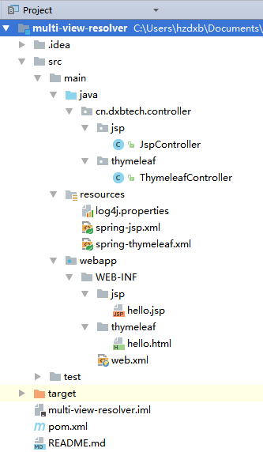

# spring mvc 整合jsp和thymeleaf两个模板引擎

代码地址
---------
[http://github.com/dingxiaobo/multi-view-resolver](http://github.com/dingxiaobo/multi-view-resolver)

分别用两个dispatcher分别解析jsp页面和thymeleaf页面
### pom.xml
```xml
...
    <!--thymeleaf-->
    <!-- https://mvnrepository.com/artifact/org.thymeleaf/thymeleaf -->
    <dependency>
        <groupId>org.thymeleaf</groupId>
        <artifactId>thymeleaf</artifactId>
        <version>3.0.6.RELEASE</version>
    </dependency>
    <!-- https://mvnrepository.com/artifact/org.thymeleaf/thymeleaf-spring4 -->
    <dependency>
        <groupId>org.thymeleaf</groupId>
        <artifactId>thymeleaf-spring4</artifactId>
        <version>3.0.6.RELEASE</version>
    </dependency>

    <!-- jsp标签库 -->
    <!-- https://mvnrepository.com/artifact/javax.servlet.jsp.jstl/javax.servlet.jsp.jstl-api -->
    <dependency>
        <groupId>javax.servlet.jsp.jstl</groupId>
        <artifactId>javax.servlet.jsp.jstl-api</artifactId>
        <version>1.2.1</version>
    </dependency>
...
```

### src/main/resources/spring-jsp.xml
```xml
...
    <!-- 配置springmvc -->
    <!-- 1.开启springmvc注解模式 -->
    <!-- 简化配置: 1.自动注册 org.springframework.web.servlet.mvc.annotation.AnnotationMethodHandlerAdapter
        org.springframework.web.servlet.mvc.annotation.DefaultAnnotationHandlerMapping
        2.提供一系列功能：数据绑定 ，数字日期的format @NumberFormat @DataTimeFormat,xml，json默认读写支持 -->
    <mvc:annotation-driven/>
    
    <!-- servlet-mapping 映射路径“/”要做的操作 -->
    <!-- 静态资源默认servlet处理 1.例如 js css 2.允许 / 做整体映射 -->
    <mvc:default-servlet-handler/>
    
    <!-- 3.jsp显示 viewResolver -->
    <bean id="jspResolver" class="org.springframework.web.servlet.view.InternalResourceViewResolver">
        <property name="viewClass"
                  value="org.springframework.web.servlet.view.JstlView"/>
        <property name="prefix" value="/WEB-INF/jsp/"/>
        <property name="suffix" value=".jsp"/>
    </bean>
    
    
    <!-- 扫描web相关的包 -->
    <context:component-scan base-package="cn.dxbtech.controller.jsp"/>
...
```

### src/main/resources/spring-thymeleaf.xml
```xml
...
    <!-- 配置springmvc -->
    <!-- 1.开启springmvc注解模式 -->
    <!-- 简化配置: 1.自动注册 org.springframework.web.servlet.mvc.annotation.AnnotationMethodHandlerAdapter
        org.springframework.web.servlet.mvc.annotation.DefaultAnnotationHandlerMapping
        2.提供一系列功能：数据绑定 ，数字日期的format @NumberFormat @DataTimeFormat,xml，json默认读写支持 -->
    <mvc:annotation-driven/>

    <!-- servlet-mapping 映射路径“/”要做的操作 -->
    <!-- 静态资源默认servlet处理 1.例如 js css 2.允许 / 做整体映射 -->
    <mvc:default-servlet-handler/>

    <!-- 使用thymeleaf解析 -->
    <bean id="templateResolver" class="org.thymeleaf.spring4.templateresolver.SpringResourceTemplateResolver">
        <property name="prefix" value="/WEB-INF/thymeleaf/"/>
        <property name="suffix" value=".html"/>
        <property name="templateMode" value="HTML"/>
        <property name="cacheable" value="false"/>
    </bean>
    <bean id="templateEngine" class="org.thymeleaf.spring4.SpringTemplateEngine">
        <property name="templateResolver" ref="templateResolver"/>
    </bean>

    <bean class="org.thymeleaf.spring4.view.ThymeleafViewResolver">
        <property name="templateEngine" ref="templateEngine"/>
    </bean>

    <!-- 扫描web相关的包 -->
    <context:component-scan base-package="cn.dxbtech.controller.thymeleaf"/>
...
```

### src/main/webapp/WEB-INF/web.xml
```xml
...
    <!--1. 配置 jsp dispatcher -->
    <servlet>
        <servlet-name>jsp-dispatcher</servlet-name>
        <servlet-class>org.springframework.web.servlet.DispatcherServlet</servlet-class>
        <!-- 配置需要加载的配置文件 -->
        <init-param>
            <param-name>contextConfigLocation</param-name>
            <param-value>classpath:spring-jsp.xml</param-value>
        </init-param>
        <load-on-startup>0</load-on-startup>
    </servlet>

    <servlet-mapping>
        <servlet-name>jsp-dispatcher</servlet-name>
        <url-pattern>*.do</url-pattern>
    </servlet-mapping>

    <!--2. 配置 thymeleaf dispatcher -->
    <servlet>
        <servlet-name>thymeleaf-dispatcher</servlet-name>
        <servlet-class>org.springframework.web.servlet.DispatcherServlet</servlet-class>
        <init-param>
            <param-name>contextConfigLocation</param-name>
            <param-value>classpath:spring-thymeleaf.xml</param-value>
        </init-param>
        <load-on-startup>1</load-on-startup>
    </servlet>

    <servlet-mapping>
        <servlet-name>thymeleaf-dispatcher</servlet-name>
        <url-pattern>*.th</url-pattern>
    </servlet-mapping>
...
```
## 项目结构


## 运行  
```
mvn tomcat7:run
```
## 测试
1.访问[http://localhost:8080/jsp.do](http://localhost:8080/jsp.do)


2.访问[http://localhost:8080/thymeleaf.th](http://localhost:8080/thymeleaf.th)


